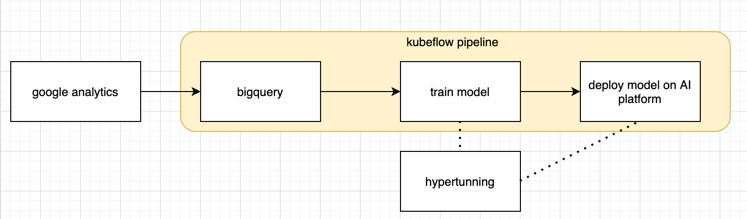
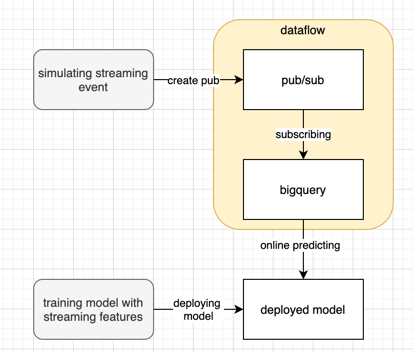

# Build multitask recommenders on GCP

## Data Structure:
- user model(query model): using features: `userId` and `organization` 
- article model(candidate model): `contentId`
- mutlitask recommender: 
    - framework: tensorflow-recommender
    - predicting:
        1. predict time spend on pages
        2. predict article wachtes
    
### File Strcture:
- [serving](serving): CI/CD; kubflow; ai-platform; bigquery; tensorflow-recommenders
  
  
- [application](application): serving model predicting API with google app engine
  
    

- [streaming](streaming): dataflow; bigquery;
  
  
  
### Global environment:
Change below environment variables into your version:
- model name: `tfrs`
- model version: `mf`
- project name: `buddie-270710`
- region: `west-europe4`
